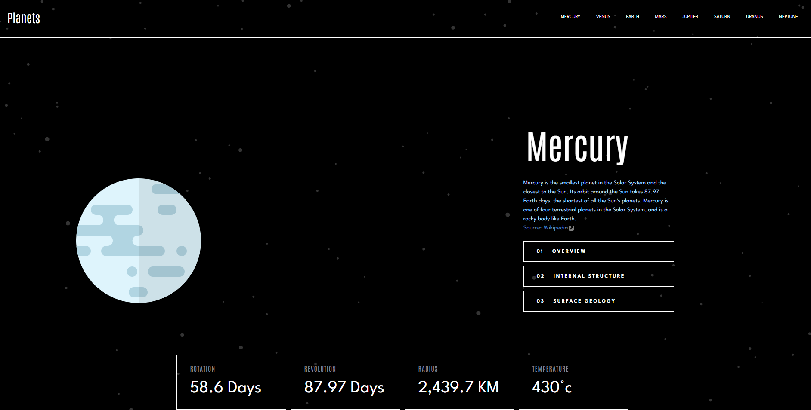

# Frontend Mentor - Planets fact site solution

This is a solution to the [Planets fact site challenge on Frontend Mentor](https://www.frontendmentor.io/challenges/planets-fact-site-gazqN8w_f). Frontend Mentor challenges help you improve your coding skills by building realistic projects.

## Table of contents

-   [Overview](#overview)
    -   [The challenge](#the-challenge)
    -   [Screenshot](#screenshot)
    -   [Links](#links)
-   [My process](#my-process)
    -   [Built with](#built-with)
    -   [What I learned](#what-i-learned)
## Overview

### The challenge

Users should be able to:

-   View the optimal layout for the app depending on their device's screen size
-   See hover states for all interactive elements on the page
-   View each planet page and toggle between "Overview", "Internal Structure", and "Surface Geology"

### Screenshot

### Links
-   Live Site URL: [Live site URL ](planets-fact-site-gilt.vercel.app)

## My process

### Built with

-   Semantic HTML5 markup
-   SASS/SCSS
-   Flexbox
-   CSS Grid
-   [React](https://reactjs.org/)
-   [React Router](https://reactrouter.com/)
  
### What I learned

This project gave me the opportunity to test my layout skills and pratice in the case of a multipage website.
It also introduce me to the dynamic routes concept and the best way to deal with it.

### Continued development

My goal will be to learn more about the new concepts this website introduced me and continue to improve my knowledge about them.

